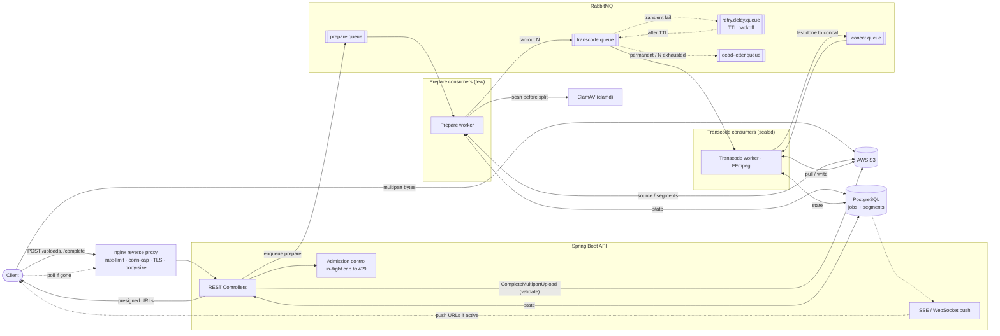
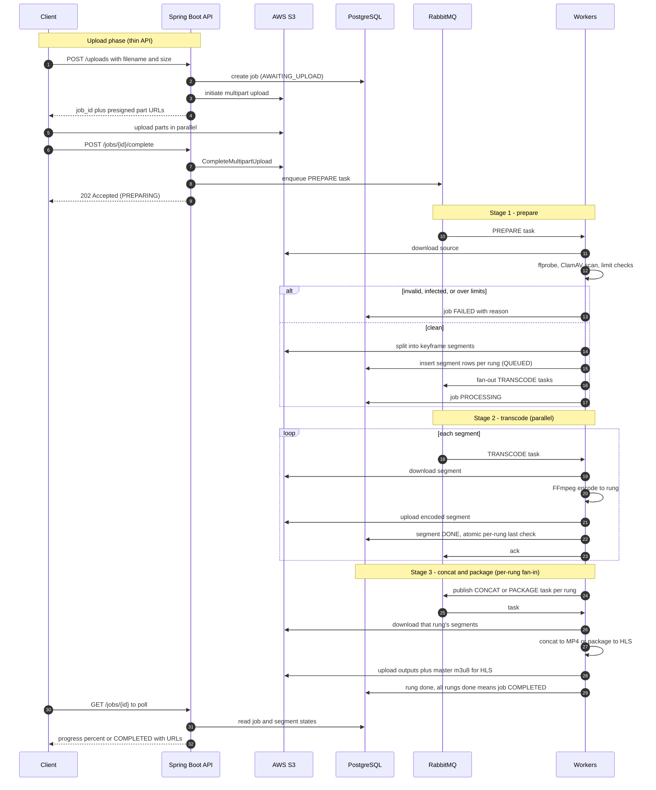
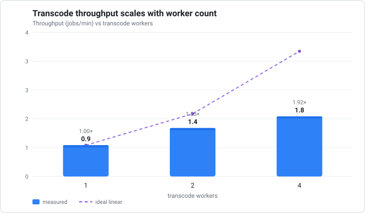

# Distributed Video Transcoding Pipeline

[](https://github.com/startershubham14/video_transcoder/actions/workflows/ci.yml)


> **Status:** Functional end-to-end locally. Upload → prepare (probe/scan/split/fan-out) →
> parallel transcode with an atomic per-rung fan-in → **MP4 and HLS** packaging, plus bounded
> retries + DLQ, reconciliation/timeout sweeps, live status (polling + SSE), Prometheus/Grafana
> metrics, and a horizontal scaling demo. Brought up with `docker compose up`; `./mvnw verify` is
> green (unit + Testcontainers integration). See [`docs/`](docs/) for the design rationale.

A distributed video-processing service that ingests a video, splits it into
keyframe-aligned segments, transcodes those segments **in parallel** across a pool of
workers, and packages the result into an adaptive-bitrate **HLS** ladder (with plain MP4
outputs as an intermediate milestone).

The transcoding itself is a solved problem (FFmpeg) — the focus of this project is the
**distributed job-processing system around it**: an async job queue, a horizontally
scalable worker pool, fan-out/fan-in coordination, failure handling, and backpressure.

## Demo

<!-- Record a 20–30s screen capture, save it as docs/img/demo.gif, then uncomment the line below.
     Recipe: docs/img/README.md -->
<!--  -->

A 20–30s walkthrough is the fastest way to see it work: upload a clip, watch **live SSE progress**,
run `docker compose up --scale transcode-worker=5` and watch the **Grafana queue drain**, then play
the **HLS output** in the browser. Recording recipe: [`docs/img/README.md`](docs/img/README.md).

## Highlights — the hard problems

The distributed-systems machinery, each backed by code **and** a test (most integration tests run
real Postgres / RabbitMQ / MinIO via Testcontainers, not mocks):

| What was hard | How it's solved | Code | Test |
|---|---|---|---|
| **Exactly-once packaging under a fan-in race** — many segment workers finish a rung concurrently; exactly one must trigger packaging | Single conditional `UPDATE … WHERE NOT EXISTS (unfinished segment)` — no read-count-then-act | [`SegmentRepository#tryClaimPackaging`](src/main/java/dev/shubham/transcoder/transcode/SegmentRepository.java:113), [`TranscodeHandler`](src/main/java/dev/shubham/transcoder/transcode/TranscodeHandler.java:105) | [`FanInRaceTest`](src/test/java/dev/shubham/transcoder/transcode/FanInRaceTest.java) |
| **Idempotent, redelivery-safe workers** — any task may be redelivered | Guarded state writes + deterministic S3 keys (overwrite, never duplicate) | [`AbstractStageWorker`](src/main/java/dev/shubham/transcoder/messaging/AbstractStageWorker.java), [`SegmentRepository#markDone`](src/main/java/dev/shubham/transcoder/transcode/SegmentRepository.java:95) | [`TranscodeHandlerTest`](src/test/java/dev/shubham/transcoder/transcode/TranscodeHandlerTest.java) |
| **No dual-write** between Postgres and RabbitMQ | Enqueue *after* the DB commit (`afterCommit`), plus a reconciliation sweep that re-drives anything stuck between commit and publish | [`UploadHandler`](src/main/java/dev/shubham/transcoder/upload/UploadHandler.java:110), [`ReconciliationSweep`](src/main/java/dev/shubham/transcoder/job/ReconciliationSweep.java) | [`ReconciliationSweepTest`](src/test/java/dev/shubham/transcoder/job/ReconciliationSweepTest.java) |
| **Transient vs permanent failure routing** — don't waste retries on unrecoverable errors | Classifier → retry via TTL-backoff delay queue, or straight to DLQ; bounded attempts | [`ErrorClassifier`](src/main/java/dev/shubham/transcoder/messaging/ErrorClassifier.java), [`RabbitMqConfig`](src/main/java/dev/shubham/transcoder/config/RabbitMqConfig.java) | [`ErrorRoutingIntegrationTest`](src/test/java/dev/shubham/transcoder/messaging/ErrorRoutingIntegrationTest.java) (real broker), [`ErrorClassifierTest`](src/test/java/dev/shubham/transcoder/messaging/ErrorClassifierTest.java) |
| **Graceful shutdown** — never drop in-flight work on scale-down | Spring graceful shutdown + listener stops before DB/S3 clients; compose `stop_grace_period` | [`RabbitMqConfig`](src/main/java/dev/shubham/transcoder/config/RabbitMqConfig.java), [`docker-compose.yml`](docker-compose.yml) | manual e2e (see DEVLOG) |
| **Backpressure / admission control** — cap concurrent jobs | Reject `/uploads` with `429` over the in-flight cap | [`AdmissionPolicy`](src/main/java/dev/shubham/transcoder/job/AdmissionPolicy.java), [`AdmissionControlInterceptor`](src/main/java/dev/shubham/transcoder/job/AdmissionControlInterceptor.java) | [`AdmissionPolicyTest`](src/test/java/dev/shubham/transcoder/job/AdmissionPolicyTest.java) |
| **Abandoned-upload cleanup** — S3 emits no event for a failed upload | Timeout reaper marks the job `EXPIRED` and `AbortMultipartUpload`s the dangling parts | [`UploadTimeoutReaper`](src/main/java/dev/shubham/transcoder/job/UploadTimeoutReaper.java) | [`UploadTimeoutReaperTest`](src/test/java/dev/shubham/transcoder/job/UploadTimeoutReaperTest.java) |
| **Open/Closed packaging** — MP4 now, HLS added without touching MP4 | Strategy + Factory over a `Packager` port | [`Packager`](src/main/java/dev/shubham/transcoder/packaging/Packager.java), [`HlsPackager`](src/main/java/dev/shubham/transcoder/packaging/HlsPackager.java), [`PackagerFactory`](src/main/java/dev/shubham/transcoder/packaging/PackagerFactory.java) | [`PackagingTest`](src/test/java/dev/shubham/transcoder/packaging/PackagingTest.java), [`HlsPackagerTest`](src/test/java/dev/shubham/transcoder/packaging/HlsPackagerTest.java) |
| **Real object-store adapter** — presign + multipart against a live store | S3 adapter exercised end-to-end (initiate → PUT part → complete → abort) on Testcontainers MinIO | [`S3BlobStore`](src/main/java/dev/shubham/transcoder/storage/S3BlobStore.java) | [`S3BlobStoreIntegrationTest`](src/test/java/dev/shubham/transcoder/storage/S3BlobStoreIntegrationTest.java) |

## Stack

**Spring Boot** (Spring Web + Spring AMQP) · **RabbitMQ** · **PostgreSQL** (Spring Data
JPA) · **AWS S3** (SDK v2) · **ClamAV** · **Docker / docker-compose**. Runs entirely
locally; workers are `@RabbitListener` consumers scaled by replica count.

## How it works

Bytes never flow through the API — the client uploads directly to S3 via presigned
multipart URLs. The API and queue carry only small control messages; **PostgreSQL is the
source of truth for job state**. The pipeline is three stages, each a queue + a listener:
`prepare` (probe → scan → split → fan-out) → `transcode` (per-segment, parallel) →
`concat/package` (per-rung fan-in → MP4 / HLS).

### Architecture



### End-to-end flow



### Checking progress

`GET /jobs/{id}` returns the job's status, a segment-derived `progress` (0–100), and — once the
job is `COMPLETED` — freshly minted presigned download URLs (one per rung for MP4; the master
manifest for HLS). URLs are never stored; they are signed on demand and expire
(`DOWNLOAD_URL_TTL_MINUTES`). Unknown ids return `404`.

For a live view, `GET /jobs/{id}/events` is a Server-Sent Events stream that pushes a `status` event
on every change (progress, then the output URLs on completion) and closes when the job reaches a
terminal state — one connection instead of polling (`curl -N http://localhost:8080/jobs/<id>/events`).
Internally, workers broadcast a small `jobId` poke on a `job.events` fanout after each commit; the API
re-reads the authoritative snapshot from Postgres and pushes it.

With `OUTPUT_MODE=hls`, packaging writes per-rung media playlists + a master `.m3u8` (reusing the
same transcoded segments — only the packaging step differs), and the status response returns the
master playlist URL. HLS outputs are served **public-read** from MinIO for the demo (a manifest
references many sibling files a single presigned URL can't cover; production would use signed
cookies / a CDN). Play it in the browser at `http://localhost:8080/player.html?src=<master url>`.

### Observability

The API exposes Prometheus metrics at `/actuator/prometheus`, computed from Postgres + RabbitMQ (so
the workers stay headless): `pipeline_jobs{status}`, `pipeline_segments{status}`, and
`pipeline_queue_depth{queue}`. `docker compose up` also starts **Prometheus** (`:9090`, scraping the
API) and **Grafana** (`:3000`, anonymous) with a provisioned dashboard — scale the transcode tier
(`docker compose up --scale transcode-worker=5`) and watch the queue depth drain and the
segments-completed rate climb.

### Scaling

Transcode throughput scales with the worker pool — see [**Results**](#results--horizontal-scaling) below.

## Results — horizontal scaling

The core claim: **transcode throughput scales with the worker pool.** Adding transcode workers drains
a batch of jobs faster, sub-linearly — the per-job prepare (probe/scan/split) and per-rung concat
stages are serial and don't parallelize (Amdahl), so the curve rises but stays under the ideal line.



| Transcode workers | Wall-clock (min) | Throughput (jobs/min) | Speedup vs 1 |
|--:|--:|--:|--:|
| 1 | 2.19 | 0.91 | 1.00× |
| 2 | 1.41 | 1.41 | 1.55× |
| 4 | 1.14 | 1.75 | 1.92× |

Throughput rises monotonically (**1.9× at 4 workers**, 0 failures). Measured with `scripts/bench.py`
(submit a batch at `--scale transcode-worker=W`, time the drain to terminal, median of 3 runs); the
chart is generated by `scripts/plot.py` from `scripts/bench_results.csv`.

**Setup:** a 24s 1080p high-detail clip (→ a 720p/480p/360p ladder — 3 rungs × 3 segments of real
FFmpeg work per job; upload was ~1s, so the run is transcode-bound), MP4 output, on a 12-core laptop.
Each transcode worker is capped at **2 CPUs** via [`docker-compose.bench.yml`](docker-compose.bench.yml)
so the pool is measurable on one host — otherwise a single unbounded FFmpeg spreads across most cores and
"add a worker" just oversubscribes. With the cap, 1→2→4 workers ≈ 2→4→8 cores, all under the 12-core
ceiling. Reproduce (`--runs 3` medians) and regenerate the chart:

```bash
for W in 1 2 4; do
  docker compose -f docker-compose.yml -f docker-compose.bench.yml up -d --scale transcode-worker=$W --no-recreate
  python scripts/bench.py your-clip.mp4 --copies 2 --runs 3 --label $W
done
python scripts/plot.py     # refreshes docs/img/scaling.svg from the CSV
```

Full method in [`scaling_benchmark.md`](scaling_benchmark.md); watch the queue drain live on the Grafana
dashboard while it runs.

## Documentation

- [`docs/design-notes.md`](docs/design-notes.md) — the **why**: project concept, stack
  rationale, infrastructure decisions, learning plan.
- [`docs/architecture-and-workflow.md`](docs/architecture-and-workflow.md) — the **how**:
  full diagrams, database schema + the atomic fan-in query, queue reliability, input
  limits, and the build order.

## Repository layout

```
.
├── docs/                     # design notes + architecture (docs/img/ holds the chart + demo GIF)
├── src/main/java/...         # Spring Boot API + workers (same codebase, Spring profiles)
├── src/main/resources/       # application*.yml (per-profile), static/player.html (hls.js)
├── db/migrations/            # schema migrations (Flyway: V1 init, V2 status→varchar, V3 upload_id)
├── scripts/                  # smoke.py (drive one job), bench.py (benchmark), plot.py (render chart)
├── docker/                   # clamav conf, prometheus config, grafana provisioning + dashboard
├── .github/workflows/ci.yml  # CI: ./mvnw verify on every PR to main
├── docker-compose.yml        # api, worker, transcode-worker, rabbitmq, postgres, minio, clamav, prometheus, grafana
├── .env.example              # config template (no secrets)
└── scaling_benchmark.md
```

## Getting started

**Prerequisites:** Docker + Docker Compose. (For local build/tests: JDK 21 — the repo ships the
Maven wrapper `./mvnw`.)

```bash
cp .env.example .env                 # defaults target the bundled MinIO; edit for real AWS
docker compose up --build            # api :8080, rabbitmq :15672, minio :9001, prometheus :9090, grafana :3000
                                     # (first boot downloads ClamAV virus defs, ~1–2 min)
```

Then drive a job (use a source **taller than 360p** so the ladder yields rungs — e.g. 720p/1080p):

```bash
python scripts/smoke.py path/to/video.mp4     # POST /uploads → PUT presigned parts → POST /complete
```

Track it: poll `GET http://localhost:8080/jobs/{id}` (status, progress, and presigned download URLs
when `COMPLETED`), or stream `curl -N http://localhost:8080/jobs/{id}/events`. Watch the pipeline in
Grafana (`http://localhost:3000`) and the queues in the RabbitMQ UI (`http://localhost:15672`,
guest/guest). Outputs land in MinIO (`http://localhost:9001`, minioadmin/minioadmin).

- **API docs:** explore the endpoints at `http://localhost:8080/swagger-ui.html` (OpenAPI spec at
  `/v3/api-docs`), auto-generated by springdoc from the controllers.
- **HLS + playback:** set `OUTPUT_MODE=hls` (in `.env`), re-run a job, then open
  `http://localhost:8080/player.html?src=<master .m3u8 url>`.
- **Scaling demo:** `docker compose up -d --scale transcode-worker=4`, then `python scripts/bench.py …`
  (see [`scaling_benchmark.md`](scaling_benchmark.md)).
- **Tests:** `./mvnw verify` (unit + Testcontainers integration — needs a Docker daemon).
- If host port 8080 is taken: `API_PORT=8081 docker compose up`.

## Security note

Secrets are never committed. AWS access is via a **dedicated, least-privilege IAM user**
scoped to a single bucket; credentials live only in a local, git-ignored `.env`. See the
design notes for the full secrets/IAM approach.
