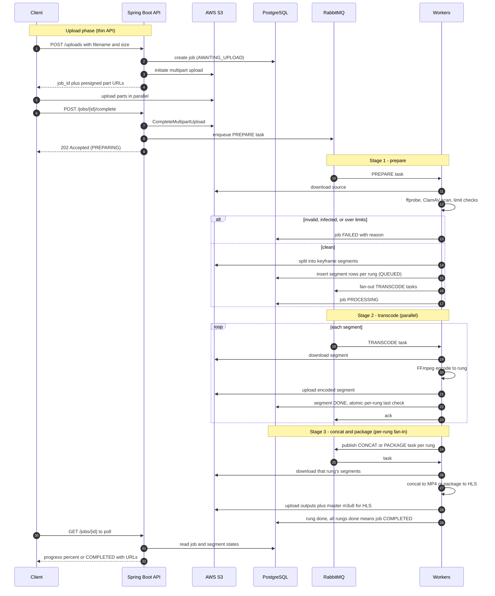

# Distributed Video Transcoding Pipeline

> **Status:** Functional end-to-end locally. Upload → prepare (probe/scan/split/fan-out) →
> parallel transcode with an atomic per-rung fan-in → **MP4 and HLS** packaging, plus bounded
> retries + DLQ, reconciliation/timeout sweeps, live status (polling + SSE), Prometheus/Grafana
> metrics, and a horizontal scaling demo. Brought up with `docker compose up`; `./mvnw verify` is
> green (unit + Testcontainers integration). See [`docs/`](docs/) for the design rationale.

A distributed video-processing service that ingests a video, splits it into
keyframe-aligned segments, transcodes those segments **in parallel** across a pool of
workers, and packages the result into an adaptive-bitrate **HLS** ladder (with plain MP4
outputs as an intermediate milestone).

The transcoding itself is a solved problem (FFmpeg) — the focus of this project is the
**distributed job-processing system around it**: an async job queue, a horizontally
scalable worker pool, fan-out/fan-in coordination, failure handling, and backpressure.

## Stack

**Spring Boot** (Spring Web + Spring AMQP) · **RabbitMQ** · **PostgreSQL** (Spring Data
JPA) · **AWS S3** (SDK v2) · **ClamAV** · **Docker / docker-compose**. Runs entirely
locally; workers are `@RabbitListener` consumers scaled by replica count.

## How it works

Bytes never flow through the API — the client uploads directly to S3 via presigned
multipart URLs. The API and queue carry only small control messages; **PostgreSQL is the
source of truth for job state**. The pipeline is three stages, each a queue + a listener:
`prepare` (probe → scan → split → fan-out) → `transcode` (per-segment, parallel) →
`concat/package` (per-rung fan-in → MP4 / HLS).

### Architecture


### End-to-end flow



### Checking progress

`GET /jobs/{id}` returns the job's status, a segment-derived `progress` (0–100), and — once the
job is `COMPLETED` — freshly minted presigned download URLs (one per rung for MP4; the master
manifest for HLS). URLs are never stored; they are signed on demand and expire
(`DOWNLOAD_URL_TTL_MINUTES`). Unknown ids return `404`.

For a live view, `GET /jobs/{id}/events` is a Server-Sent Events stream that pushes a `status` event
on every change (progress, then the output URLs on completion) and closes when the job reaches a
terminal state — one connection instead of polling (`curl -N http://localhost:8080/jobs/<id>/events`).
Internally, workers broadcast a small `jobId` poke on a `job.events` fanout after each commit; the API
re-reads the authoritative snapshot from Postgres and pushes it.

With `OUTPUT_MODE=hls`, packaging writes per-rung media playlists + a master `.m3u8` (reusing the
same transcoded segments — only the packaging step differs), and the status response returns the
master playlist URL. HLS outputs are served **public-read** from MinIO for the demo (a manifest
references many sibling files a single presigned URL can't cover; production would use signed
cookies / a CDN). Play it in the browser at `http://localhost:8080/player.html?src=<master url>`.

### Observability

The API exposes Prometheus metrics at `/actuator/prometheus`, computed from Postgres + RabbitMQ (so
the workers stay headless): `pipeline_jobs{status}`, `pipeline_segments{status}`, and
`pipeline_queue_depth{queue}`. `docker compose up` also starts **Prometheus** (`:9090`, scraping the
API) and **Grafana** (`:3000`, anonymous) with a provisioned dashboard — scale the transcode tier
(`docker compose up --scale transcode-worker=5`) and watch the queue depth drain and the
segments-completed rate climb.

### Scaling

The core claim — transcode throughput scales with worker count — is measured by
[`scaling_benchmark.md`](scaling_benchmark.md) using `scripts/bench.py`: bring the transcode tier up
at a given size (`docker compose up -d --scale transcode-worker=W`), submit K jobs, and time the
drain. Watch it live on the Grafana dashboard. A first run (single-run, small clip) is recorded in
[`scaling_benchmark.md`](scaling_benchmark.md): throughput climbs sharply 1→2 workers, then regresses
at 4 as FFmpeg oversubscribes a laptop's cores — the expected plateau. Re-run with a heavier clip and
3× medians for a rigorous curve.

## Documentation

- [`docs/design-notes.md`](docs/design-notes.md) — the **why**: project concept, stack
  rationale, infrastructure decisions, learning plan.
- [`docs/architecture-and-workflow.md`](docs/architecture-and-workflow.md) — the **how**:
  full diagrams, database schema + the atomic fan-in query, queue reliability, input
  limits, and the build order.

## Repository layout

```
.
├── docs/                     # design notes + architecture
├── src/main/java/...         # Spring Boot API + workers (same codebase, Spring profiles)
├── src/main/resources/       # application*.yml (per-profile), static/player.html (hls.js)
├── db/migrations/            # schema migrations (Flyway: V1 init, V2 status→varchar)
├── scripts/                  # smoke.py (drive one job), bench.py (scaling benchmark)
├── docker/                   # clamav conf, prometheus config, grafana provisioning + dashboard
├── .github/workflows/ci.yml  # CI: ./mvnw verify on every PR to main
├── docker-compose.yml        # api, worker, transcode-worker, rabbitmq, postgres, minio, clamav, prometheus, grafana
├── .env.example              # config template (no secrets)
└── scaling_benchmark.md
```

## Getting started

**Prerequisites:** Docker + Docker Compose. (For local build/tests: JDK 21 — the repo ships the
Maven wrapper `./mvnw`.)

```bash
cp .env.example .env                 # defaults target the bundled MinIO; edit for real AWS
docker compose up --build            # api :8080, rabbitmq :15672, minio :9001, prometheus :9090, grafana :3000
                                     # (first boot downloads ClamAV virus defs, ~1–2 min)
```

Then drive a job (use a source **taller than 360p** so the ladder yields rungs — e.g. 720p/1080p):

```bash
python scripts/smoke.py path/to/video.mp4     # POST /uploads → PUT presigned parts → POST /complete
```

Track it: poll `GET http://localhost:8080/jobs/{id}` (status, progress, and presigned download URLs
when `COMPLETED`), or stream `curl -N http://localhost:8080/jobs/{id}/events`. Watch the pipeline in
Grafana (`http://localhost:3000`) and the queues in the RabbitMQ UI (`http://localhost:15672`,
guest/guest). Outputs land in MinIO (`http://localhost:9001`, minioadmin/minioadmin).

- **HLS + playback:** set `OUTPUT_MODE=hls` (in `.env`), re-run a job, then open
  `http://localhost:8080/player.html?src=<master .m3u8 url>`.
- **Scaling demo:** `docker compose up -d --scale transcode-worker=4`, then `python scripts/bench.py …`
  (see [`scaling_benchmark.md`](scaling_benchmark.md)).
- **Tests:** `./mvnw verify` (unit + Testcontainers integration — needs a Docker daemon).
- If host port 8080 is taken: `API_PORT=8081 docker compose up`.

## Security note

Secrets are never committed. AWS access is via a **dedicated, least-privilege IAM user**
scoped to a single bucket; credentials live only in a local, git-ignored `.env`. See the
design notes for the full secrets/IAM approach.
