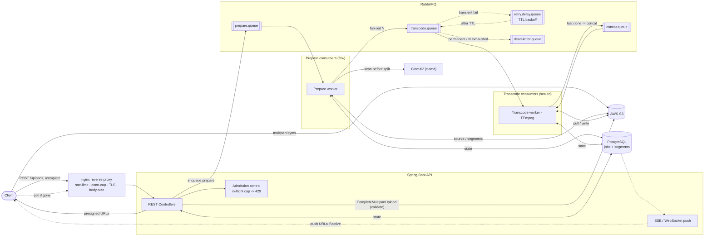
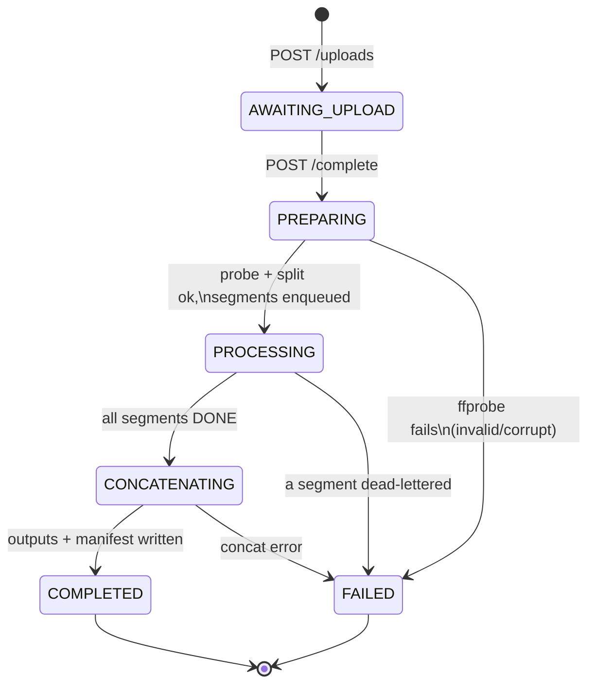
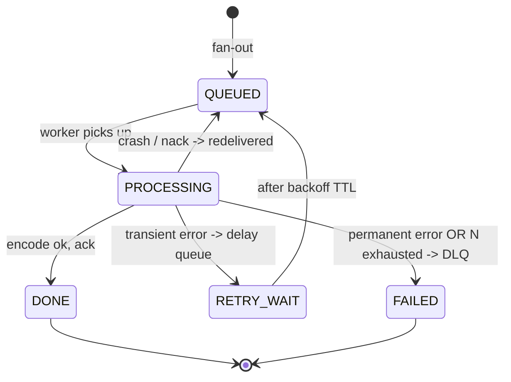

# Architecture & Workflow

Companion to the design notes. Diagrams are **Mermaid** — GitHub renders them
natively in a README, and they live as text next to the code.

**Final stack:** Spring Boot (Spring Web + Spring AMQP) · RabbitMQ · PostgreSQL
(Spring Data JPA) · AWS S3 (SDK v2) · Docker/compose. Workers are `@RabbitListener`
consumers of the same codebase, run as a small fixed pool (~1 per CPU core).

**Pipeline is three stages, each a queue + a listener:**
`prepare` (probe + **ClamAV scan** + split + fan-out) → `transcode` (per-segment,
parallel) → `concat/package` (fan-in, stitch to MP4 / package to HLS). Failed tasks
take a **retry/delay queue** (exponential backoff) and, once retries are exhausted or the
error is permanent, a **dead-letter queue**.

**Edge + admission:** an **nginx reverse proxy** fronts the API (per-IP rate limiting,
connection caps, TLS, request-body limits); the API adds **semantic admission control**
(cap in-flight jobs → `429`). Two independent layers — the proxy knows requests/IPs,
the app knows jobs.

---

## 1. Component / architecture diagram

Shows the moving parts and how bytes vs. control-messages flow. Note the splits:
**large video bytes go straight to S3** (never through the API); the API and queue
only move small control messages; **PostgreSQL is the source of truth for state**;
**prepare and transcode have separate consumer pools** so a transcode backlog can't
starve incoming jobs; failed tasks flow through a **retry/delay** queue then a **DLQ**.



---

## 2. Sequence diagram (end-to-end data flow)

The full lifecycle over time. The three stages are visible: prepare, the parallel
transcode loop, and the concat fan-in. Nothing heavy runs inside an HTTP request —
the API only creates rows, hands out presigned URLs, and enqueues tasks.

```mermaid
sequenceDiagram
    autonumber
    participant C as Client
    participant API as Spring Boot API
    participant S3 as AWS S3
    participant DB as PostgreSQL
    participant MQ as RabbitMQ
    participant W as Worker(s)

    Note over C,API: Upload phase (thin API)
    C->>API: POST /uploads (filename, size)
    API->>DB: create job (AWAITING_UPLOAD)
    API->>S3: initiate multipart upload
    API-->>C: job_id + presigned part URLs
    C->>S3: upload parts in parallel (bytes)
    C->>API: POST /jobs/{id}/complete
    API->>S3: CompleteMultipartUpload
    API->>MQ: enqueue PREPARE task
    API-->>C: 202 Accepted (PREPARING)

    Note over W,MQ: Stage 1 - prepare (one worker)
    MQ->>W: PREPARE task
    W->>S3: download source
    W->>W: ffprobe (validity, duration, size)
    alt invalid / corrupt / over limits
        W->>DB: job FAILED (reason)
    else valid
        W->>W: ClamAV scan
        alt malware detected
            W->>DB: job FAILED (infected)
        else clean
            W->>DB: save metadata, derive output ladder
            W->>S3: split into keyframe segments (-c copy)
            W->>DB: insert segment rows per rung (QUEUED), set total_segments
            W->>MQ: publish TRANSCODE tasks (fan-out)
            W->>DB: job PROCESSING
        end
    end

    Note over W,MQ: Stage 2 - transcode (N workers, parallel)
    loop each segment
        MQ->>W: TRANSCODE task
        W->>DB: segment PROCESSING
        W->>S3: download segment
        W->>W: FFmpeg encode -> target rung
        W->>S3: upload encoded segment
        W->>DB: segment DONE (atomic: am I the last?)
        W->>MQ: ack
    end

    Note over W,DB: Stage 3 - concat/package (fan-in, triggered by last worker of a rung)
    W->>MQ: publish CONCAT/PACKAGE task (per rung)
    MQ->>W: CONCAT/PACKAGE task
    W->>S3: download that rung's encoded segments
    W->>W: FFmpeg concat -> MP4  (milestone)  OR  package -> HLS .ts + .m3u8 (goal)
    W->>S3: upload final outputs (+ master .m3u8 when HLS)
    W->>DB: mark rung done; when all rungs done -> job COMPLETED

    Note over C,API: Status (poll throughout)
    C->>API: GET /jobs/{id}
    API->>DB: read job + segment states
    API-->>C: progress % or COMPLETED + output URLs
```

---

## 3. Job state machine

The overall job status, driven by the three stages.



## 4. Segment state machine

Per-segment lifecycle. This is where the reliability story lives: a crashed worker
never acked, so RabbitMQ redelivers the message; retries are bounded, then the
segment is dead-lettered and marked FAILED.



---

## 5. Queue reliability & backpressure

The queue is a **controlled buffer, not a dumping ground.** Four mechanisms keep it
from filling with failures or starving a stage:

- **Bounded retries + DLQ.** A task redelivers at most N times, then dead-letters and
  the segment is marked `FAILED`. Failures *leave* the main queue — they don't loop.
- **Permanent vs. transient classification** (highest-leverage fix). Permanent errors
  (corrupt input, missing key) → DLQ on the **first** attempt; retrying them is wasted
  work. Transient errors (S3 `503`, timeout) → retry with backoff. This alone kills
  most "retry storm" throughput collapse.
- **Exponential backoff via a delay queue.** RabbitMQ has no native redelivery delay,
  so a transient failure is published to a `retry.delay.queue` with a TTL; on expiry it
  dead-letters *back* to the transcode queue. A fast-failing task no longer spins.
- **Per-stage consumer isolation.** Prepare and transcode have separate consumer pools,
  so a transcode backlog (or a flood of failing segments) **cannot starve the prepare
  queue** — new jobs are still accepted and split promptly. This is the head-of-line-
  blocking fix.

**Overload (real work faster than drain), handled at two layers:**
- **nginx** — coarse per-IP rate limiting / connection caps at the edge.
- **App admission control** — cap in-flight jobs; over the cap, reject `/uploads` with
  `429`. Refusing work you can't handle beats accepting it and collapsing.
- **Prefetch = 1** per worker so a backlog spreads evenly, not hoarded by a few workers.
- RabbitMQ **queue-length limits** with overflow-to-DLQ as a broker-level backstop.

## 6. Upload failure handling & completion delivery

**Confirming upload completion — S3 confirms, not the client.** The client's `/complete`
is a trigger; the authority is **`CompleteMultipartUpload`**, which succeeds only if every
part (matched by ETag) is present and intact. Transcoding is enqueued **only after S3
returns success**, followed by a `HeadObject` size check and optional checksum verify.

**How the client learns about a *failed* upload — there is no S3 push for failures.**
Because the client uploads **directly to S3**, the server isn't in the byte path, and
**S3 event notifications are success-only** (`ObjectCreated`). So:
- **During upload:** S3 returns the HTTP error **directly to the client** on the failed
  part; the client retries **just that part** (a multipart advantage). The server isn't
  involved.
- **Server-side detection** comes from (a) `CompleteMultipartUpload` **rejecting** a
  bad/missing-part upload — surfaced to the client on the `/complete` response; and
  (b) a **timeout reaper** — a job stuck in `AWAITING_UPLOAD` past a deadline is marked
  `EXPIRED`, its multipart upload aborted, and the client sees that status on next poll.
- **Backstop:** S3 lifecycle rule `AbortIncompleteMultipartUpload` after N days.

**Delivering outputs — storage is unconditional; only delivery branches.** Encoded
outputs are **always** written to S3. On completion:
- **Client active** → push download URLs immediately over SSE/WebSocket.
- **Client gone** → outputs are already persisted; client gets URLs on next poll/login.

**Never persist presigned URLs** — they expire. Store the **S3 object key** in Postgres
and **mint a fresh presigned GET URL on demand** each time the client asks.

## 7. Segmentation strategy & input limits

**Segments must start on keyframes.** A segment is only independently decodable (hence
transcodable in parallel) if it begins on a keyframe / GOP boundary. So you **cannot cut
at an arbitrary 8.000 s** — the target length is *approximate*.

**Frame rate matters via keyframe spacing, not as a tuning knob.** Keyframe interval is
counted in *frames*; where those land in *time* depends on fps. A 250-frame GOP = 10 s at
25 fps, ~8.3 s at 30 fps, ~4.2 s at 60 fps. So fps determines which segment lengths are
achievable; you pick a target and the keyframe grid rounds to it.

Two split strategies:
- **Option A (default): `-c copy`, keyframe-snapped.** Cheap, fast (no re-encode at split
  time), but segment lengths are *uneven* and dictated by the source's keyframe density.
  If a source has sparse keyframes, "8 s" segments may come out much longer and
  parallelism suffers.
- **Option B (fallback): force a keyframe grid first.** Re-encode with a fixed GOP
  (`-g fps*8 -keyint_min fps*8 -force_key_frames`), then split → uniform segments, at the
  cost of an upfront full re-encode. Use for pathological GOP structures.

Target segment length is a **config value** (default ~8–10 s), so 4 vs 8 vs 12 can be
benchmarked without code changes. (Note: "power of 2" is irrelevant for a wall-clock
duration — no alignment benefit; ~8 s is chosen for the parallelism/overhead balance,
to be tuned empirically.)

**Input limits — cap BOTH size and duration; they guard different failures.**
`size ≈ bitrate × duration`, and bitrate varies wildly (1080p ≈ 1 MB/s; 4K ≈ 5 MB/s;
ProRes ≈ GBs/min), so neither cap implies the other.
- **Size cap** guards disk / bandwidth / S3 cost (short but huge-bitrate file).
- **Duration cap** guards segment-count / queue explosion / total encode time (long but
  low-bitrate file).
- **Values (configurable):** max **5 min** duration, max **~2 GB** size. (5 min keeps
  local encode + real-S3 cost trivial; at 5 min even 4K ≈ 1.7 GB, so a 10 GB cap would
  never bind — 2 GB is sufficient.) Bump via env for a "scales" demo.
- **Two checkpoints:** declared size at `/uploads` (cheap, untrusted early reject);
  **real duration + size after `ffprobe`** in prepare (authoritative — declared values
  can lie).
- **No separate output cap needed:** the down-scaled ladder sums to *less* than the 1080p
  input, so bounding input bounds output.

## 8. Output target — MP4 milestone, HLS goal

Not either/or; a sequencing choice. **The expensive 90% of the pipeline is identical**
(upload, probe, scan, split, parallel transcode) — only the final packaging step differs,
so MP4 → HLS is an evolution, not a rewrite.

- **Separate MP4s (milestone):** concat each rung's segments into one standalone
  `720p.mp4` / `480p.mp4` / `360p.mp4`. Plays in any `<video>` tag, no special player.
  Proves the pipeline end-to-end.
- **HLS (goal):** package the *same* transcoded segments into `.ts` chunks + a per-rung
  media `.m3u8`, plus one **master `.m3u8`** listing rungs by bandwidth. `hls.js` switches
  rung by bandwidth — real adaptive streaming. Naturally fits the segment-based pipeline
  (you mostly write playlists referencing segments you already have).

**Three build milestones (each demoable — never "nothing works"):**
1. MP4, single rung — pipeline end-to-end.
2. MP4, full ladder — real fan-out/fan-in across rungs. **Safe finish line** if time runs short.
3. HLS — swap packaging, add master playlist + `hls.js` page. **Upside.**

Schema impact is tiny: one nullable `jobs.manifest_key` (master `.m3u8`), null on MP4,
set on HLS. Diagram impact: the concat stage becomes "concat/package" — same position,
same trigger. (Uniform HLS segment durations mildly favour the force-GOP split later;
keyframe-snapped segments still produce valid HLS.)

## 9. Database schema (single PostgreSQL)

One Postgres for everything — `users`, `jobs`, `segments`. Chosen over SQLite because the
**fan-in requires concurrent writers**, exactly SQLite's single-writer weakness. Fan-in is
**per-rung**: each resolution is concatenated/packaged independently as its own segments
finish, so completion is checked per rung and the atomic claim includes the rung.

```sql
CREATE TYPE job_status     AS ENUM
  ('AWAITING_UPLOAD','PREPARING','PROCESSING','CONCATENATING','COMPLETED','FAILED','EXPIRED');
CREATE TYPE segment_status AS ENUM
  ('QUEUED','PROCESSING','DONE','RETRY_WAIT','FAILED');

CREATE TABLE users (
    id          UUID PRIMARY KEY DEFAULT gen_random_uuid(),
    email       TEXT UNIQUE NOT NULL,
    created_at  TIMESTAMPTZ NOT NULL DEFAULT now()
);

CREATE TABLE jobs (
    id                UUID PRIMARY KEY DEFAULT gen_random_uuid(),
    user_id           UUID NOT NULL REFERENCES users(id),
    status            job_status NOT NULL DEFAULT 'AWAITING_UPLOAD',
    source_key        TEXT,                 -- s3: {id}/source.mp4
    -- probed metadata (filled in prepare, after ffprobe)
    source_width      INT,
    source_height     INT,
    duration_seconds  NUMERIC,
    fps               NUMERIC,
    source_codec      TEXT,
    size_bytes        BIGINT,
    -- output
    manifest_key      TEXT,                 -- master .m3u8 (HLS); NULL for MP4
    error_reason      TEXT,
    upload_deadline   TIMESTAMPTZ,          -- for the timeout reaper
    created_at        TIMESTAMPTZ NOT NULL DEFAULT now(),
    updated_at        TIMESTAMPTZ NOT NULL DEFAULT now()
);
CREATE INDEX idx_jobs_status   ON jobs(status);
CREATE INDEX idx_jobs_deadline ON jobs(upload_deadline) WHERE status = 'AWAITING_UPLOAD';

CREATE TABLE segments (
    id                  UUID PRIMARY KEY DEFAULT gen_random_uuid(),
    job_id              UUID NOT NULL REFERENCES jobs(id) ON DELETE CASCADE,
    rung                TEXT NOT NULL,       -- '720p' | '480p' | '360p'
    segment_index       INT  NOT NULL,       -- ordering for concat/playlist
    status              segment_status NOT NULL DEFAULT 'QUEUED',
    attempts            INT  NOT NULL DEFAULT 0,   -- checked against N = 3
    source_segment_key  TEXT NOT NULL,
    output_segment_key  TEXT,
    created_at          TIMESTAMPTZ NOT NULL DEFAULT now(),
    updated_at          TIMESTAMPTZ NOT NULL DEFAULT now(),
    -- idempotency: a replayed fan-out cannot create duplicate rows
    UNIQUE (job_id, rung, segment_index)
);
CREATE INDEX idx_segments_job_rung ON segments(job_id, rung);
```

### The atomic fan-in (per-rung) — the crux

Every worker, on finishing a segment, marks it `DONE`, then attempts a **single conditional
update** that exactly one worker per rung can win. The read-then-write alternative has a
check-then-act race; this does not.

```sql
-- 1) mark my segment done (idempotent)
UPDATE segments SET status = 'DONE', updated_at = now()
WHERE id = :segment_id AND status <> 'DONE';

-- 2) claim the concat/package trigger for THIS rung — only one worker's UPDATE hits a row
UPDATE jobs
SET status = 'CONCATENATING', updated_at = now()
WHERE id = :job_id
  AND status IN ('PROCESSING','CONCATENATING')      -- other rungs may already be packaging
  AND NOT EXISTS (                                    -- no unfinished segment left in this rung
      SELECT 1 FROM segments
      WHERE job_id = :job_id AND rung = :rung AND status <> 'DONE'
  );
-- rows affected = 1 -> I am the winner for this rung -> enqueue CONCAT/PACKAGE(:rung)
-- rows affected = 0 -> siblings remain, or another worker already claimed -> do nothing
```

Postgres serializes the row-level write, so for a given rung exactly one worker sees
"1 row affected" and enqueues packaging; everyone else sees 0 and backs off. Job
completion (all rungs packaged) is a final guarded update that flips `jobs.status` to
`COMPLETED` only when no segment is left un-`DONE` and every rung's output is written —
again one conditional `UPDATE ... WHERE`, so it fires once.

**Left out on purpose:** soft-deletes, audit tables, a separate `outputs` table
(`segments.output_segment_key` + `jobs.manifest_key` suffice). Add tables only when a real
query needs them.

---

## Key decisions the diagrams encode

- **Bytes never flow through the API.** Client ↔ S3 directly via presigned URLs
  (multipart in, downloads out). API and queue carry only small control messages.
- **PostgreSQL is the source of truth**, not the queue. The queue dispatches; the DB
  records what exists and its state. "Is the job done?" = "are all its segment rows DONE?"
- **Three-stage pipeline** (prepare / transcode / concat-package), each an idempotent task
  type on its own queue. Keeps every stage off the HTTP request thread.
- **Fan-in via an atomic per-rung DB update.** On finishing a segment, a worker runs a
  conditional `UPDATE ... WHERE NOT EXISTS (unfinished segment in this rung)` to claim the
  packaging trigger — this resolves the race where two workers finish simultaneously.
  Exactly one claimant per rung enqueues concat/package.
- **Bounded retries + dead-letter.** A task redelivers on crash (never acked); after
  N attempts it lands in the dead-letter queue and the segment is marked FAILED.
- **Idempotent outputs.** Encoded segments are written under deterministic,
  segment-id-keyed S3 keys, so a redelivered task overwrites cleanly instead of duplicating.
- **Enqueue only after the DB commit (dual-write safety).** At every hand-off
  (`/complete` → prepare, prepare → fan-out, last segment → concat): commit the state
  change to Postgres *first*, then publish to RabbitMQ. A publish that fails leaves the job
  recoverable by a **reconciliation sweep**; combined with **idempotent workers** (safe to
  replay), a duplicate message is harmless. Production-grade version: transactional outbox
  (write the message as a row in the same DB transaction; a poller publishes it).

## Resolved this round

- **Edge protection:** nginx reverse proxy (rate/conn/TLS/body limits) + app-level
  admission control (`429` on in-flight cap). Two independent layers.
- **Upload confirmation:** S3's `CompleteMultipartUpload` is the authority, not the client.
- **Failure signalling:** no S3 push for failed uploads — client sees S3's HTTP error
  directly and retries the part; server detects via completion-rejection + timeout reaper.
- **Output delivery:** always stored in S3; pushed via SSE if client active, else pulled
  on poll. Persist S3 keys, mint presigned URLs on demand.
- **Enqueue-after-commit rule** at all three hand-off points; reconciliation sweep +
  idempotent workers for dual-write safety.
- **Segmentation:** keyframe-snapped `-c copy` (Option A) default; force-GOP (Option B)
  fallback. Target length configurable, default ~8–10 s, to be benchmarked.
- **Retry policy:** N = 3 attempts, backoff 2 s → 8 s → 30 s, then DLQ.
- **Input limits:** max 5 min / ~2 GB (both configurable); declared-size gate at
  `/uploads`, authoritative duration+size gate after `ffprobe`. No separate output cap.

## Still open

*All architectural decisions are settled.* What remains is implementation, in build order:

1. `docker-compose` skeleton (API, RabbitMQ, Postgres, worker image, ClamAV, MinIO-or-S3).
2. DB migrations (the schema above) + Spring Data JPA entities.
3. Upload flow: `/uploads` (presigned multipart) → `/complete` (validate → enqueue prepare).
4. Prepare worker: probe → ClamAV scan → limits → keyframe split → fan-out.
5. Transcode worker: per-segment FFmpeg + the atomic per-rung fan-in.
6. Concat/package worker: **MP4 milestone** first, then **HLS**.
7. Status: poll `GET /jobs/{id}` first; SSE push later.
8. Reliability: retry/delay queue, DLQ, reconciliation sweep, timeout reaper.
9. Scaling demo: `--scale transcode-worker=N` + a throughput metric.
10. README: architecture diagrams, secrets/IAM note, recorded demo, "production extensions"
    (Kubernetes, transactional outbox, streaming ingestion, tiered limits).

## Config knobs (all env-driven)

`SEGMENT_TARGET_SECONDS` (~8) · `MAX_DURATION_SECONDS` (300) · `MAX_SIZE_BYTES` (~2 GB) ·
`RETRY_MAX_ATTEMPTS` (3) · `RETRY_BACKOFF` (2s,8s,30s) · `PREFETCH` (1) ·
`IN_FLIGHT_JOB_CAP` · `UPLOAD_DEADLINE_MINUTES` · `OUTPUT_MODE` (mp4|hls).
